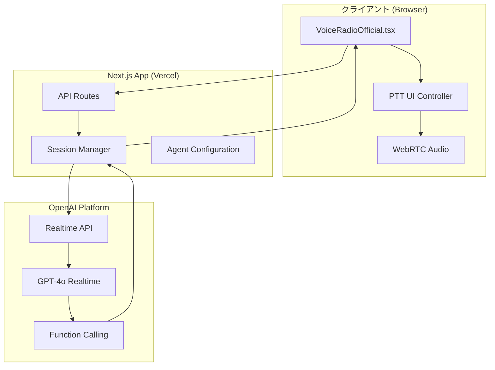

# 技術アーキテクチャ仕様書

## システム概要

博多ポートラジオAIは、OpenAI Realtime APIを活用したリアルタイム音声通信システムです。真のVHF無線機を模擬したPTT (Push-to-Talk) 機能と、IMO SMCP準拠の海事通信プロトコルを実装しています。

## システムアーキテクチャ

### 全体構成図



## コア技術コンポーネント

### 1. 音声通信制御 (VoiceRadioOfficial.tsx)

#### PTT制御システム
```typescript
interface PTTController {
  startTransmission: () => Promise<void>;
  stopTransmission: () => Promise<void>;
  isTransmitting: boolean;
}

// 実装の核心
const startTransmission = async () => {
  sessionRef.current.mute(false);  // 音声認識有効化
  setIsTransmitting(true);
};

const stopTransmission = async () => {
  sessionRef.current.mute(true);   // 音声認識無効化
  setIsTransmitting(false);
  // 音声処理完了後にAI応答開始
};
```

#### 状態管理
```typescript
interface VoiceRadioState {
  isConnected: boolean;
  isTransmitting: boolean;
  connectionStatus: string;
  isResponding: boolean;
  audioPlaying: boolean;
  channelStatuses: ChannelStatus[];
}
```

### 2. チャンネル管理システム

#### データ構造
```typescript
interface ChannelStatus {
  channel: number;                    // VHFチャンネル番号
  status: 'available' | 'assigned';   // チャンネル状態
  vesselName?: string;                // 割当先船舶名
  assignedAt?: string;                // 割当時刻
}

// デフォルトチャンネル設定
const defaultChannels = [
  { channel: 8, status: 'available' },   // 船舶間通信用
  { channel: 10, status: 'available' },  // 港内作業連絡用
  { channel: 12, status: 'available' }   // 港務通信用
];
```

#### チャンネル割当アルゴリズム
```typescript
const assignChannel = (vesselName: string): number => {
  const availableChannel = channelStatuses.find(ch => ch.status === 'available');
  
  if (!availableChannel) return 0; // エラー値
  
  // UI状態の即座更新
  setChannelStatuses(prev => prev.map(ch => 
    ch.channel === availableChannel.channel 
      ? { 
          ...ch, 
          status: 'assigned',
          vesselName,
          assignedAt: new Date().toLocaleTimeString('ja-JP')
        }
      : ch
  ));
  
  return availableChannel.channel;
};
```

### 3. OpenAI Agents統合

#### エージェント設定
```typescript
const createPortRadioAgent = () => {
  return new RealtimeAgent({
    name: "博多ポートラジオ管制官",
    instructions: `
      あなたは博多ポートラジオの熟練した管制官AIです。
      PTTシステムで船舶からの通信に応答してください。
      
      # PTTシステムの特徴
      - 船舶がボタンを押している間の音声のみが送信されます
      - PTTボタンを離すと音声送信が完了し、応答の番になります
      - 1回のPTT送信に対して1回のみ応答してください
      
      # 基本プロトコル
      1. 呼びかけ形式: "博多ポートラジオ、こちら[船舶名]"
      2. 標準応答: "こちら博多ポートラジオ、[船舶名]どうぞ"
      3. チャンネル割当: assignVHFChannelツール使用
    `,
    voice: "alloy",
    tools: [/* Function Calling定義 */]
  });
};
```

#### Function Calling実装
```typescript
tools: [
  tool({
    name: 'assignVHFChannel',
    description: 'VHFチャンネルを船舶に割り当てる関数',
    parameters: z.object({
      vesselName: z.string().describe('船舶名'),
      requestType: z.string().describe('要求種別'),
      priority: z.enum(['normal', 'urgent', 'emergency']).default('normal')
    }),
    execute: async ({ vesselName, requestType, priority }) => {
      const assignedChannel = assignChannel(vesselName);
      return JSON.stringify({
        success: assignedChannel > 0,
        vesselName,
        assignedChannel,
        requestType,
        priority,
        timestamp: new Date().toISOString()
      });
    }
  })
]
```

### 4. セッション管理とイベント処理

#### セッション初期化
```typescript
const startConnection = async () => {
  const agent = createPortRadioAgent();
  const session = new RealtimeSession(agent);
  
  await session.connect({
    apiKey: process.env.NEXT_PUBLIC_OPENAI_API_KEY,
    model: "gpt-4o-realtime-preview"
  });
  
  // デフォルトでミュート（PTT制御用）
  session.mute(true);
  
  setupSessionHandlers(session);
};
```

#### イベントハンドラー
```typescript
const setupSessionHandlers = (session: RealtimeSession) => {
  // 音声応答制御
  session.on('agent_start', (context, agent) => {
    // 連続応答防止ロジック
    const timeSinceLastResponse = Date.now() - lastResponseTimeRef.current;
    if (timeSinceLastResponse < 3000) return;
    
    setIsResponding(true);
    lastResponseTimeRef.current = Date.now();
  });
  
  // Function Call実行
  session.on('agent_tool_start', (context, agent, tool, details) => {
    console.log('🔧 Function Call:', tool.name);
  });
  
  session.on('agent_tool_end', (context, agent, tool, result) => {
    console.log('✅ Function Call完了:', result);
    // UI状態の更新処理
  });
};
```

## データフロー

### 1. PTT操作フロー
```
ユーザー操作 → PTT Button Press → session.mute(false) 
→ 音声認識開始 → PTT Button Release → session.mute(true)
→ 音声処理 → AI応答生成 → 音声出力
```

### 2. チャンネル割当フロー
```
船舶要求 → 音声認識 → Function Call Trigger 
→ assignVHFChannel実行 → チャンネル検索 → UI状態更新
→ 結果返却 → AI応答生成 → 音声出力
```

### 3. エラーハンドリングフロー
```
エラー発生 → Error Event → ログ出力 → UI状態更新
→ ユーザー通知 → セッション復旧処理
```

## パフォーマンス仕様

### レスポンス時間
- **音声認識遅延**: 50-100ms (WebRTC)
- **AI処理時間**: 200-500ms (OpenAI Realtime API)
- **音声出力遅延**: 50-100ms (ブラウザAudio)
- **総レスポンス時間**: 300-700ms

### リソース使用量
- **メモリ使用量**: ~50MB (ブラウザ)
- **CPU使用率**: 5-15% (音声処理中)
- **ネットワーク帯域**: ~64kbps (音声ストリーム)

## セキュリティ仕様

### API Key管理
```typescript
// 環境変数による安全な管理
const apiKey = process.env.NEXT_PUBLIC_OPENAI_API_KEY;

// クライアント側での検証
if (!apiKey || !apiKey.startsWith('sk-proj-')) {
  throw new Error('無効なAPIキー');
}
```

### データ保護
- **音声データ**: メモリ内のみ保存、永続化なし
- **通信履歴**: セッション中のみ保持
- **チャンネル状態**: ローカル状態管理のみ

## 拡張性考慮事項

### スケーラビリティ
- **同時接続数**: Vercel Serverless制限内
- **チャンネル管理**: Redis等での永続化対応可能
- **音声処理**: OpenAI API制限内

### 機能拡張ポイント
- **多言語対応**: プロンプト・UI国際化
- **音声品質向上**: ノイズフィルタリング強化
- **ログ管理**: 通信履歴の永続化
- **認証システム**: ユーザー管理・権限制御

## 技術的制約事項

### ブラウザ制約
- **対応ブラウザ**: Chrome 88+, Firefox 90+, Safari 14+
- **HTTPS必須**: WebRTC仕様による
- **マイク権限**: ユーザー許可必須

### API制約
- **OpenAI Realtime**: 同時接続数制限
- **レート制限**: API呼出数制限
- **モデル制約**: gpt-4o-realtime-previewのみ対応

## デプロイメント要件

### 環境変数
```env
NEXT_PUBLIC_OPENAI_API_KEY=sk-proj-xxxxx
VERCEL_URL=auto-generated
```

### ビルド要件
```json
{
  "engines": {
    "node": ">=20.0.0",
    "npm": ">=10.0.0"
  }
}
```

### Vercel設定
```json
{
  "functions": {
    "app/api/realtime/session/route.ts": {
      "maxDuration": 30
    }
  }
}
```

---

この仕様書は実装の詳細な技術仕様を記録し、将来の機能拡張・保守作業の指針として活用されます。